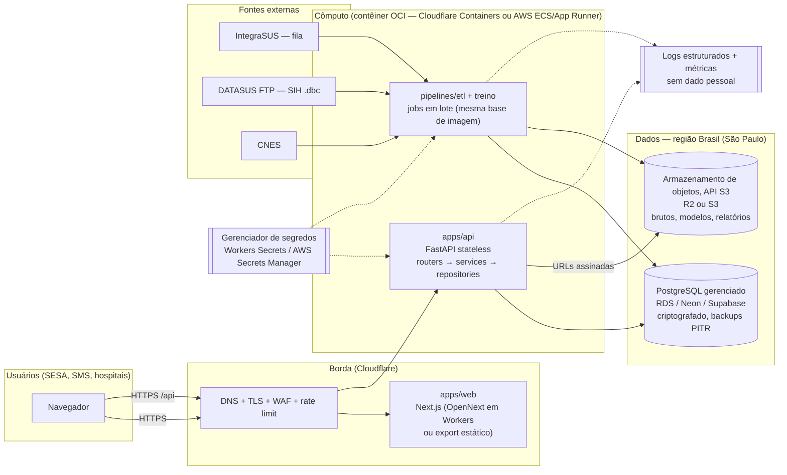
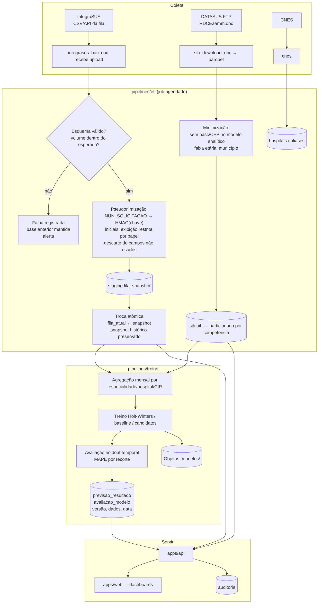
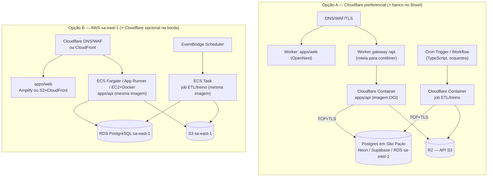
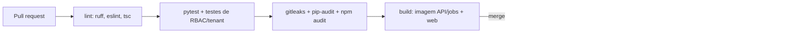

# Visão geral da arquitetura alvo — PREDMED

- **Status:** proposta, aguardando aprovação
- **Data:** 28/09/2026
- **Documentos relacionados:** [diagnóstico](diagnostico.md), [estrutura de pastas](estrutura-pastas.md), [segurança e LGPD](seguranca-lgpd.md), [ADRs](adr/)

## 1. Requisitos que guiam a arquitetura

| Origem | Requisito | Consequência arquitetural |
|---|---|---|
| Proposta Centelha (p. 2–3) | Modo somente leitura, apoio à decisão | Não há integração de escrita com sistemas de regulação; "aprovar" vira "registrar revisão da recomendação" com auditoria |
| Proposta (p. 2–3) | Anonimização nos modelos, criptografia em trânsito e em repouso | Treino usa apenas agregados ou dados pseudonimizados; TLS em todas as conexões; banco e objetos criptografados |
| Proposta (p. 3) | Arquitetura leve para conexões lentas | Frontend estático/edge, respostas JSON paginadas e comprimidas, previsões pré-calculadas |
| Proposta (Etapa 1, atividade 2) | Ambientes dev/homolog/prod separados; CI/CD no GitHub Actions | Três ambientes com IaC; deploy por pipeline |
| CLAUDE.md | Multi-tenant (SESA, SMS, hospitais públicos e privados) | Escopo de dados por tenant/CIR/município/CNES aplicado no repositório |
| Responsável (28/09/2026) | Cloudflare preferencial, compatível com AWS | Contêiner OCI + Postgres padrão + API S3; adaptadores isolam o provedor |
| Rubrica de nuvem | R$ 9.552 / 12 meses ≈ R$ 796/mês (também cobre licenças e APIs) | Poucos serviços gerenciados caros; escala a zero onde possível |

## 2. Componentes

### Responsabilidades

| Componente | Faz | Não faz |
|---|---|---|
| `apps/web` | UI, autenticação via cookie `HttpOnly`, cache de respostas públicas | Regras de negócio, acesso direto ao banco |
| `apps/api` | Autenticação, RBAC e escopo de tenant, leitura de fila/previsões/analytics, registro de revisão de recomendações, auditoria | Treinar modelos, baixar SIH, processar CSVs grandes em linha |
| `pipelines/etl` | Coleta, validação de esquema, pseudonimização, carga idempotente com snapshot | Servir HTTP |
| `pipelines/treino` | Treino e avaliação holdout; publica `previsao_resultado` e `avaliacao_modelo` versionados | Ler dado identificável (apenas agregados) |
| PostgreSQL | Fonte de verdade transacional e analítica (MVP) | — |
| Objetos (S3/R2) | Arquivos brutos com retenção curta, modelos serializados, exportações PDF/CSV | Guardar dado pessoal sem criptografia e sem ciclo de vida |

## 3. Fluxo de dados

Regras do fluxo:

- **Nada é apagado antes de a nova carga ser validada.** Snapshots IntegraSUS têm retenção definida (seção 6 do documento LGPD).
- O **modelo nunca vê identificadores**. Treina sobre séries agregadas, o que cumpre a "anonimização nos modelos" da proposta.
- Toda previsão exibida carrega `versao_modelo`, `periodo_dados`, `avaliado_em` e `status_validacao` (`validado` | `nao_validado` | `simulado`), atendendo T02 e T03 do checklist.
- Frequência do IntegraSUS: definida após verificar a fonte (E2.5). O agendamento é diário por padrão, e a interface exibe a "última atualização válida".

## 4. Implantação — portabilidade Cloudflare × AWS

A mesma imagem da API e dos jobs roda nos dois provedores. O que muda é só a "cola" em `infra/`.

### Recomendação (detalhes e custos no [ADR-003](adr/003-nuvem-portavel-cloudflare-aws.md))

- **Homologação:** Opção A (Cloudflare Containers + Postgres em São Paulo), apenas com dados **sintéticos ou pseudonimizados**. É barata, atende a preferência do responsável e valida a portabilidade.
- **Produção (piloto com dado real):** híbrido. **Cloudflare na borda e no frontend; API, jobs, banco e objetos com dado pessoal na AWS sa-east-1** (ou Postgres gerenciado em São Paulo), **até** que se comprove controle de localização do cômputo em Cloudflare Containers no Brasil e latência aceitável ao banco. A documentação atual não oferece restrição de região para Containers nem localização Brasil para R2.
- A troca entre A e B é feita por variáveis de ambiente e por `infra/`. O código da aplicação não muda.

### Pontos específicos de provedor e como isolar

| Ponto | Cloudflare | AWS | Isolamento |
|---|---|---|---|
| Cômputo da API | Container acionado por Worker/Durable Object; disco efêmero; hiberna (`sleepAfter`) | ECS/App Runner/EC2 | Imagem OCI única, `PORT` por variável, API sem estado |
| Banco | Conexão direta do contêiner ao Postgres (Hyperdrive é para Workers, não para o contêiner) | RDS | `DATABASE_URL`; SQLAlchemy + Alembic; sem extensões proprietárias |
| Objetos | R2 (endpoint S3) | S3 | `core/storage.py` com boto3 e `S3_ENDPOINT_URL`, `S3_BUCKET`, credenciais por variável |
| Agendamento | Cron Trigger + Workflow (JS/TS) disparando contêiner de job | EventBridge Scheduler → ECS RunTask | Job é um CLI (`python -m pipelines.etl integrasus`); o agendador só chama o comando |
| Segredos | `wrangler secret` / Secrets Store | Secrets Manager / SSM | A aplicação lê apenas variáveis de ambiente |
| Frontend | OpenNext (`@opennextjs/cloudflare`) | Amplify ou S3+CloudFront | Next.js padrão; `NEXT_PUBLIC_API_URL` no build |
| Logs | Workers Logs / Logpush | CloudWatch | JSON em stdout |
| IaC | `wrangler.jsonc` / Terraform provider Cloudflare | Terraform/CDK | `infra/cloudflare`, `infra/aws`; nada disso importado pelo código |

## 5. Ambientes

| Ambiente | Dados | Onde | Deploy |
|---|---|---|---|
| **dev** | SQLite ou Postgres em `docker compose`; fixtures sintéticas; bases reais só na máquina do responsável, fora do git | Local (`./start.sh`) | manual |
| **homolog** | Sintéticos + SIH público agregado + fila **pseudonimizada** | Cloudflare (Opção A) | automático a cada merge em `main` |
| **prod** | Dados reais sob contrato/termo com a instituição | Híbrido (Opção B para dados) | tag `vX.Y.Z` + aprovação manual no GitHub Environments |

Cada ambiente tem banco, bucket, segredos e chave de pseudonimização próprios. Não se copia banco de produção para homolog.

## 6. CI/CD (GitHub Actions)

- Credenciais de deploy via OIDC (AWS) e token de API com escopo mínimo (Cloudflare), guardados em GitHub Environments.
- Migração Alembic roda como passo separado, com backup/snapshot imediatamente antes em produção.

## 7. Arquitetura leve para conexões lentas

- Frontend servido da borda; bundles por rota; Chart.js **ou** Recharts (hoje há os dois, então escolher um).
- API com `GZip`/Brotli na borda, paginação obrigatória, `ETag` e `Cache-Control` em respostas agregadas (previsões e analytics mudam no máximo diariamente).
- Previsões pré-calculadas pelos jobs. A API nunca treina durante a requisição.
- Estados de "sem conexão" e "dados desatualizados" na UI (E2.4).

## 8. Decisões registradas

| ADR | Tema | Status |
|---|---|---|
| [001](adr/001-estrutura-monorepo.md) | Estrutura de monorepo e backend em camadas | Proposto |
| [002](adr/002-postgresql-alembic.md) | PostgreSQL + Alembic | Proposto |
| [003](adr/003-nuvem-portavel-cloudflare-aws.md) | Nuvem portátil Cloudflare/AWS | Proposto |
| [004](adr/004-seguranca-lgpd-auditoria.md) | Segurança, LGPD e auditoria | Proposto |
| [005](adr/005-retirar-artefatos-dados-git.md) | Retirar artefatos e dados do git | Proposto (não executar sem aprovação) |
